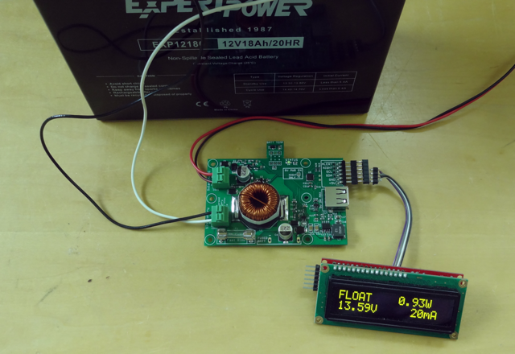
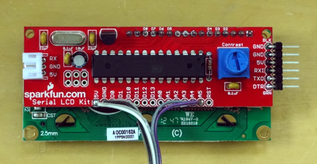

## MPPT Solar Charger Arduino Library

This directory contains a simple Arduino library providing access the the MPPT Solar Charger via I2C and a couple of simple example sketches.  The library can also be compiled on a Raspberry Pi (requires [wiringPi](http://wiringpi.com/download-and-install/)).

### Sample Sketches

1. lib\_ser\_test - Reads several values from the board and outputs their values via the serial port.
2. lib\_ole\_test - Displays the charge state, solar power, battery voltage and current draw on a 2x16 character OLED display.  This sketch may be easily ported to a LCD-based 2x16 character display.  My prototype uses a Sparkfun LCD driver board that is actually an Arduino.

### Linux Example
The linux directory contains a simple example using the library on a Raspberry Pi.  Put the source in the same directory as the library files and use the command line in the 'm' file to compile.  It assumes wiringPi has been installed.