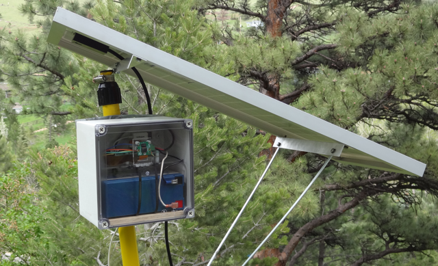
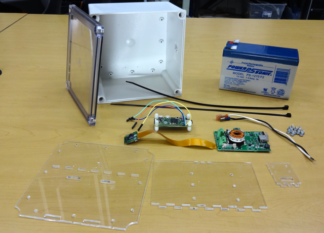
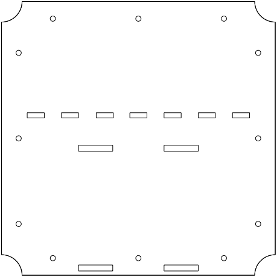
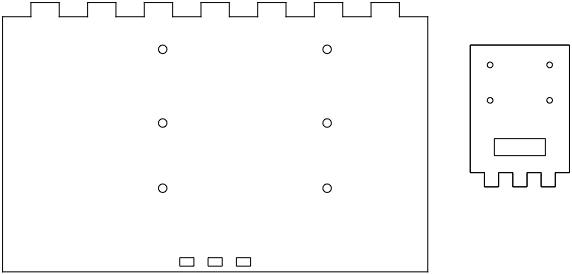
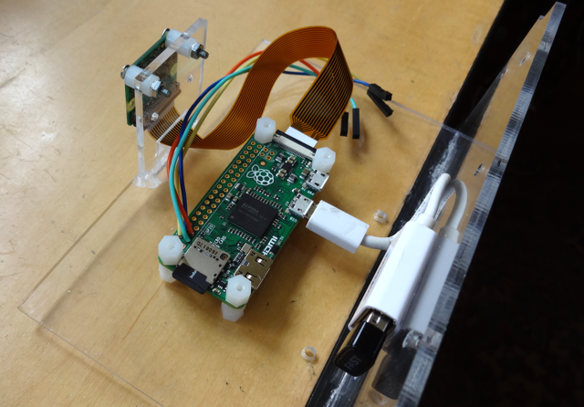
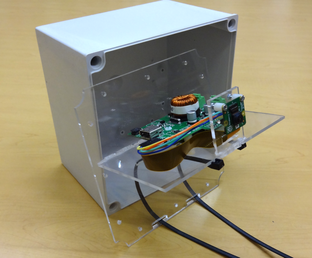
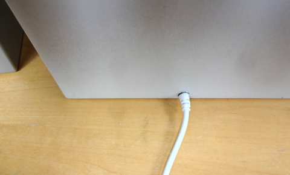
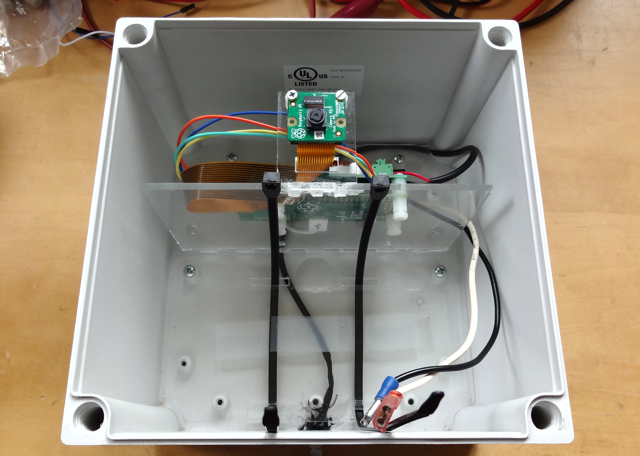
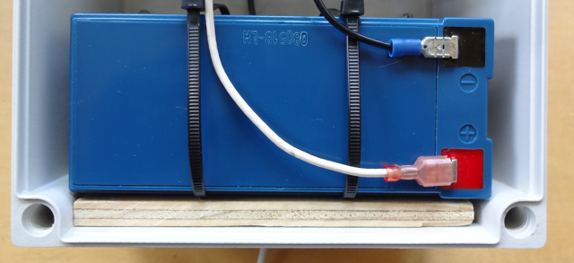

# Camera Enclosure
The Bud Industries [PIP-11774-C]((https://www.budind.com/view/NEMA+Boxes/NEMA+4X+-+PIP)) enclosure with clear lid, available through distributors like Mouser, can be used with a set of laser-cut acrylic panels as a waterproof enclosure for an outdoor camera.

This example describes a build using the makerPower™ solar charger, a Raspberry Pi Zero (with external USB WiFi dongle), Pi Camera and 7 Ah battery.  Mounting holes are included to support full-size Raspberry Pi boards as well.

Some additional parts are also required.

1. Stand-offs for the Raspberry Pi and charger (they should allow the charger to be mounted above the Pi).
2. Zip-ties long enough to attach the battery to its mounting plate (at least 14"/36mm long).
3. 4 wires to connect Pi to charger.  I used commonly available connector cables with a female dupont connector on one end for the charger and directly soldered to the Pi on the other.
4. 2 18 AWG battery connectors with 6.3mm spade terminals.
5. 2-conductor cable (18-20 AWG) for solar panel connection.  This is passed through a hole in the enclosure.
6. Mounting hardware or thick double-sticky tape to mount the camera module.
7. Cut piece of plywood to sit below battery (5x3x0.375" / 127x76x9.5mm).

## Acrylic Cut Outs
Three pieces of laser-cut acrylic plastic are used to mount the camera, electronics and battery inside the enclosure.  I used the Macintosh program EazyDraw 7 to create the parts and output DXF versions and Inkscape to convert them into the LYZ files the laser cutter at my makerspace requires.  These files along with PDF versions are included in the "design_files" directory here.

A mounting plate attaches the battery and a shelf to the enclosure.  It will require an approximately 200 x 200 mm piece of plastic (I used 0.125" / 3.175mm thick).  It has screw holes matching the enclosure, a set of slots for the other piece of plastic and cut-outs for Zip Ties to hold the battery.

A shelf has screw holes for the stacked Raspberry Pi and charger and a set of slots for the camera mount.  The camera mount includes screw holes matching the Raspberry Pi camera module and a cut-out for the flex cable.  Both are cut from the same piece of plastic (approx 250 x 200 mm).

## Assembly
I used a Cyanoacrylate Glue ("Super Glue") to attach the shelf to the mounting plate and camera mount to the shelf.  Make sure you don't do what I did and initially put the camera mount on the wrong side.  It should go on the opposite side from the battery mount.

The Pi is mounted on the bottom and charger on top.

I dressed the power cable for the Solar Panel through a small hole in the bottom of the enclosure, behind the mounting plate and sealed with liquid electrical tape.

The assembled unit is inserted and attached to the enclosure before installing the battery. 

The battery is then inserted and zip tied in place.  I put the small piece of plywood under the battery to relieve strain on the zip ties.

## Condensation Note
This [link](https://www.thethingsnetwork.org/forum/t/condensation-with-waterproof-enclosure-node/3053/7) contains information about managing condensation in sealed enclosures.  If condensation is a concern then it appears that providing a breathable but waterproof venting mechanism or conformally coating all the electronics may be a solution.

## Battery Temperature Compensation
In extreme environments it is a good idea to remove the external temperature sensor from the makerPower charger board and mount it on the battery with a short 3-wire cable.  The sensor may be taped to the top surface of the battery.