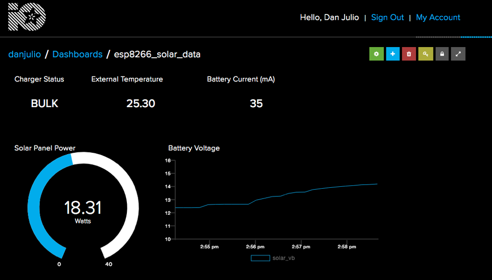
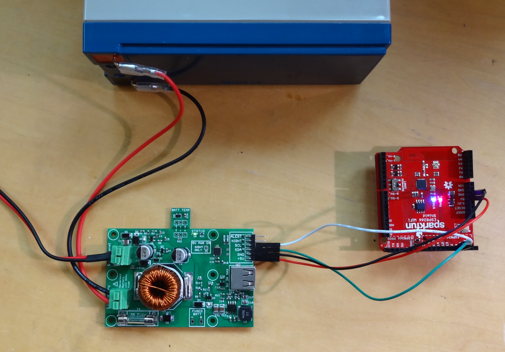
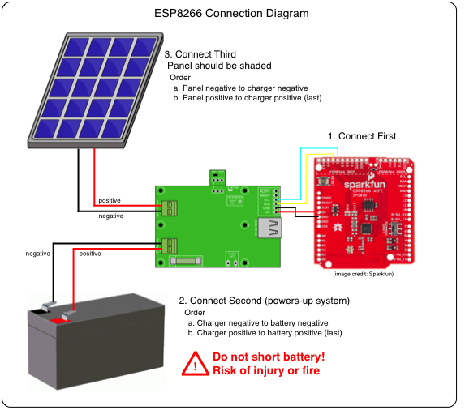

# ESP8266 / mpptChg Library / Adafruit IO

[Adafruit IO](https://io.adafruit.com/) is an awesome and easy way to display data from remotely connected devices in a web browser.  This example shows how to use an ESP8266 to upload data from the makerPower™ charger to the Adafruit IO system (using the free version) and display it on a custom dashboard. 



This example logs and displays the following pieces of data from the charger.  It can easily be modified to handle additional data values (within the maximum limit of 10 enforced by the free version).

1. Charger State : Text display showing charge state: IDLE, NIGHT, BULK, ABSORPTION or FLOAT
2. External Temperature Sensor Value : Text display showing value of external temperature sensor in °C.
3. Battery Load Current : Text display showing the load taken by the ESP8266 system in mA.
4. Battery Voltage : Real-time graph showing the battery voltage in volts.
5. Solar Panel Power : Gauge display showing the solar panel production in watts (computed from the solar panel voltage and solar panel current).

## Hardware
I used a [Sparkfun ESP8266 WiFi Shield](https://www.sparkfun.com/products/13287) with the default AT command firmware replaced by the code here but any ESP8266 module should work.  You may have to provide a 5V to 3.3V regulator for modules without one built-in.



Four wires are all that is needed to provide power and communications to the module.  Since the ESP8266 does not have a built-in I2C hardware peripheral, this functionality is provided by a software library.  Then benefit of the library is that any two GPIO pins may be used for the I2C interface.  I chose D2 and D4 but you can change these in the firmware sketch to match those you might have on your module.



| Charger | ESP8266 |
|---------|---------|
|    5V   |    5V   |
|   GND   |   GND   |
|   SDA   |    D4   |
|   SCL   |    D2   |

## Adafruit IO Setup
Create an account at [Adafruit IO](https://io.adafruit.com/) if you have not already done so.  Your user name (and AIO key) will be included in the sketch running on the ESP8266 to connect it with your account.

The following links provide a good overview of how to configure and use the Adafruit IO system.  Essentially there are two halves to the system.  Feeds are endpoints for our device to communicate with that store specific data points.  We create five feeds.  The Dashboard is a collection of different types of display widgets (called blocks) associated with feeds that render the data in the web browser.  We include five widgets, one for each feed.

1. [Data Feeds](https://learn.adafruit.com/adafruit-io-basics-feeds)
2. [Creating Dashboards](https://learn.adafruit.com/adafruit-io-basics-dashboards)
3. [API Docs](https://io.adafruit.com/api/docs/)
4. [ESP8266 and Adafruit IO](https://learn.adafruit.com/home-automation-in-the-cloud-with-the-esp8266-and-adafruit-io)

### Feeds
Following the instructions in the Data Feeds link above, create the following five feeds (feed name shown).  Although each feed has several parameters, the only one that absolutely must match is the feed name.  Other parameters allow you to do things like keep a history of values (or just the most recent) and add additional descriptive text to each feed.  The names must match because they are used by the firmware sketch.

1. solar_ib
2. solar_power
3. solar_status
4. solar_temp
5. solar_vb

### Dashboard
Following the instructions in the Creating Dashboards link above, create a new dashboard called "esp8266\_solar\_data".  Open the new dashboard and add a block for each feed (five in total).  I list the block types I used (and are shown in the image above).  However you can use different block types if you desire.  For example instead of a text block displaying the battery current, you could use a gauge.  The process of adding a block will allow you to enter information such as what feed it is associated with, font sizes, and display range limits.

1. Text Block with name "Battery Current (mA) for the solar_ib feed.
2. Gauge Block with name "Solar Panel Power" and range 0-40 for the solar_power feed.
3. Text Block with name "Charger Status" for the solar_status feed.
4. Text Block with name "External Temperature" for the solar_temp feed.
5. Line Graph Block with name "Battery Voltage" and range 10-16 the for solar_vb feed.

Selecting the tool icon in the Dashboard display allows you to push the various blocks around and resize them to organize the layout of your display.

Adafruit IO is ready to recieve and display data once the feeds and dashboard have been setup.

## Firmware
Firmware for the ESP8266, located in the ```esp8266_solar_data``` directory, was written and programmed in the Arduino environment using a FTDI TTL serial cable to download compiled code to the board (the serial port also serves as a diagnostic output).  Sparkfun provides a handy [tutorial](https://learn.sparkfun.com/tutorials/esp8266-wifi-shield-hookup-guide/all) explaining how to load code onto their board.

You must load support for the ESP8266 into the Arduino IDE using the Board Manager.  The following libraries are also required.

1. [mpptChg](https://github.com/danjulio/MPPT-Solar-Charger/tree/master/arduino) - the charger Arduino library found in a parent directory of this repository.
2. [Adafruit\_MQTT\_Library](https://github.com/adafruit/Adafruit_MQTT_Library) - the library used to communicate with Adafruit IO.

### Setup Arduino IDE
Select the "Sparkfun ESP8266 Thing" under the Tools menu for board type.  Plug in the FTDI cable and select the appropriate COM/Serial port.

### Configure the sketch
Load the ```esp8266_solar_data.ino``` sketch into the IDE.  You need to change some default constants to match your environment.  Find the section of code with the "User parameters" comment.

1. Change ```"WLAN_SSID"``` to the SSID of the WiFi network you will be connecting to.
2. Change ```"WLAN_PASS"``` to your WiFi password (or leave as an empty string if the network has no password).
3. Change ```"AIO_USERNAME"``` to the Adafruit IO account name you setup when you created the account.
4. Change ```"AIO_KEY"``` to the security key associated with your Adafruit IO account (this can be found by clicking the "View AIO Key" from the IO homepage when you are logged in.

The pins used for I2C are set by the ```SDA_PIN``` and ```SCL_PIN``` defines.

The built-in LED on D5 is used to provide some status.  You may also change the ```LED_PIN``` if your module's LED is on a different pin.

Compile and download the sketch.

### Operation
The sketch first attempts to connect to the local WiFi.  It rapidly blinks the LED during this process.  After connecting to WiFi it then attempts to connect with the Adafruit IO service.  The LED blinks slowing during this process.  Once connected the LED is turned on.

The program reads information from the charger in a burst and then attempts to log the five pieces of data at a rate of one data point every two seconds in order to comply with the rate limit for free accounts enforced by Adafruit.  The complete set of data points should be updated and displayed on the dashboard about every ten seconds.

The sketch logs status and diagnostic information to the serial port at 115200 baud.  You can use this information to help debug problems.  Since the FTDI serial cable provides 5V power from the attached computer, it is not necessary to have the +5V power line connecting the charger with the ESP8266.  The other three signals (GND, SDA, SCL) should remain connected while debugging.