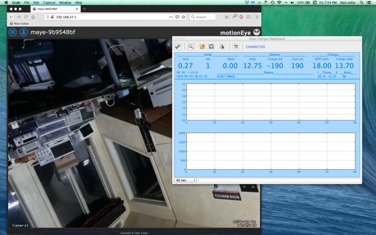

# motioneyeos with mpptChgD daemon
Calin Crisan's exellent [motioneyeos](https://github.com/ccrisan/motioneyeos) is a complete Linux distribution that turns a Linux SBC like the Raspberry Pi into a highly functional webcam.  He provides excellent instructions for installation and configuration; some are referenced here.  These instructions also show how to include and configure the charger daemon for a system based on a Raspberry Pi that fully integrates the charger with a web cam based on motioneyeos.



Running for the first time in the lab (note the charged battery!)

## Hardware configuration
In addition to the solar charger, battery and solar panel you will need the following components.

1. Supported single board computer (SBC) with camera (see Calin's repository for a list).
1. Micro-SD Card (8 GB - or larger - gives plenty of room to store images and video)
1. Four wires or jumpers connecting the charger's +5, Ground, SDA and SCL lines to the SBC.

## motioneyeos installation

### Install motioneyeos
These steps install motioneyeos to operate on an existing wired network (for example using the Raspberry Pi 3's ethernet port).  Consult the [motioneyeos wiki](https://github.com/ccrisan/motioneyeos/wiki/Installation) for instructions to configure the system to connect to a wireless network.

1. Download the latest stable release from [releases](https://github.com/ccrisan/motioneyeos/releases).
1. Extract the image from the archive.
1. Write the OS Image to your SD Card as described in the wiki.  You will configure your wireless networking here if necessary.  On my Mac and a wired Raspberry Pi 3, I just used [Etcher](https://etcher.io/).
1. (Re)mount the newly installed SD Card on the same computer you used to install the software from (remove and re-install the SD Card).  You should see a FAT partition that contains the boot files.  Edit the ```config.txt``` file in that partition to include the following line.  This works around a bug in the Pi I2C Hardware that manifests with the charger's I2C interface.

	```
	dtparam=i2c_arm_baudrate=50000
	```

### Boot motioneyeos
Unmount the SD Card and put in the Raspberry Pi.  The Pi should be connected to the solar charger with the 12V battery disconnected (the battery should have some charge).  Then power up the Raspberry Pi by connecting the battery.  The initial boot may take a couple of minutes as motioneyeos configures itself.  You can see the progress if you have a monitor attached to the Pi (you can log in too if you have a keyboard).  After the system boots and motioneye starts you should be able to view your webcam by pointing your browser at the Pi's IP address.  This address is displayed on the monitor if one is attached and can also be found using tools like nmap on a computer or Fing on a cell phone.


## mpptChgD daemon installation
The motioneyeos distribution creates a partion, ```/data```, that may be used to store persistent changes.  It is created during the first boot.  We manually put the ```mpptChgD``` daemon and supporting files in this partition.

You will need the pre-built ```mpptChgD``` binary and associated ```libwiringPi.so.X.Y``` library file from elsewhere on this [github](https://github.com/danjulio/MPPT-Solar-Charger/tree/master/mpptChgD) as well as the pre-configured ```mpptChgDconfig.txt``` and ```userinit.sh``` files from this repository.

### Install files
Use ```ssh``` to login to the motioneyeos system: ```ssh root@<IP ADDRESS>```.  There is no password by default (you should set one).

1. Create a new directory ```/data/mpptChg```.  This will hold the daemon and support files.

1. Copy the following files into ```/data/mpptChg``` (using ```scp``` if they are located on another system).
 * ```mpptChgD```
 * ```libwiringPi.so.X.Y``` (where "X.Y" are the version found here)
 * ```mpptChgDconfig.txt``` (by default this enables network access and low-battery shutdown.  Optinally, you can also enable it to log data to ```/data/log/mpptChgDlog.txt``` and/or enable the watchdog function if you want to power cycle the Pi if it crashes).
1. Create a soft link, in the ```/data/mpptChg``` directory, to the wiringPi library: ```ln -s libwiringPi.so.X.Y libwiringPi.so```

1. Copy the ```userinit.sh``` file from this repository to ```/data/etc/userinit.sh```.  This file will start the daemon each time the system is rebooted.

Type ```reboot``` to restart the system and the ```mpptChgD``` daemon.  After it reboots you should be able to access the charger remotely by pointing the ```mppt_dashboard``` program at the IP address of the motioneyeos system.  Click the tools icon on ```mppt_dashboard``` to enter the IP address.

## [Optional] Enable the Pi to act as a WiFi Access Point
The motioneyeos software may also be configured to create its own network, acting as a WiFi access point.  This may be useful for a remote time-lapse or security system located in an area without WiFi.  Configuring the system as a WiFi access point must be done after the initial installation/boot and installation of the mpptChgD daemon.  Detailed instructions can be found at [WiFi-Access-Point](https://github.com/ccrisan/motioneyeos/wiki/WiFi-Access-Point).

Important Notes:

1. This may not work with all WiFi interfaces (it has been tested on Raspberry Pi 3 and Zero W).

1. For some reason I don't understand enabling this mode disables ssh access so it's important to have finished the installation before performing these steps.

### Installation steps
1. Download and edit the ```hostapd.conf``` and ```dnsmasq.conf``` files from this repository and edit them to configure your network.
  * The ```hostapd.conf``` file configures the WiFi access point.  ```ssid``` and ```wpa_passphrase``` set the name and password for the network.
  * The ```dnsmasq.conf``` file configures the Pi to serve DHCP addresses.  The example file serves them in the range ```192.18.27.50``` to ```192.168.27.150```.
1. Copy these files, using the ```scp``` utility, to the motioneyeos system ```/data/etc/``` directory: ```scp *.conf root@<IP ADDRESS>:/data/etc```.

1. Login to the motioneyeos system and edit the ```/data/etc/os.conf``` file.  Disable the network by changing the ```os_networkless="false"``` entry to ```os_networkless="true"```.  This prevents the system from attempting to connect to another network as a client when it boots and failing (which causes it to panic and reboot endlessly).  Don't worry as this was Calin's intended operation.

1. Type ```reboot``` to switch the system from your existing network to creating its own ad-hoc WiFi network.  Note that it's possible to make your system inaccessible if you've made a mistake in one of the configuration files.  You can access it directly through an attached keyboard/monitor to attempt repairs.