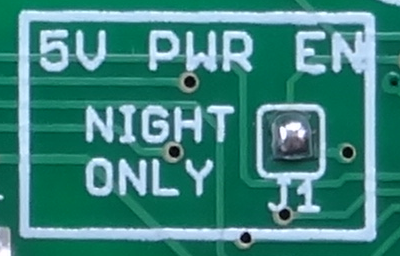
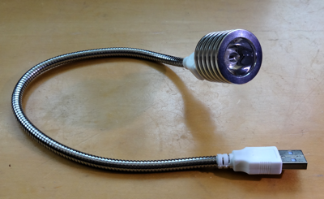
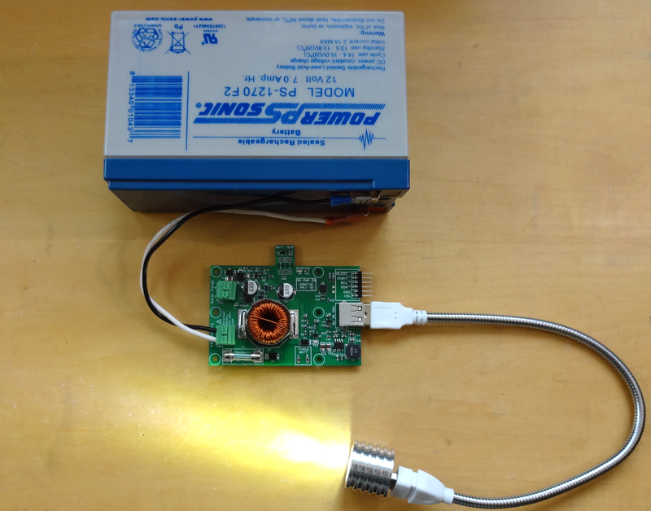
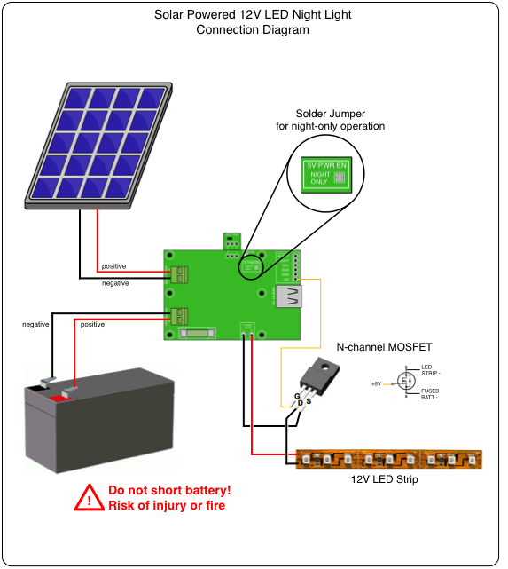
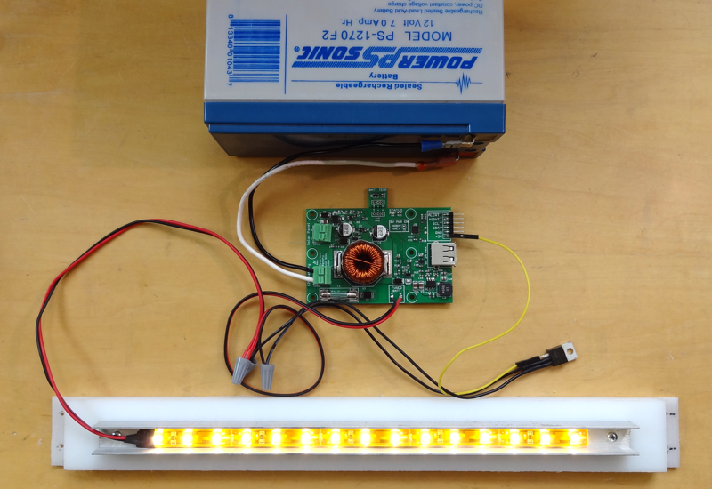
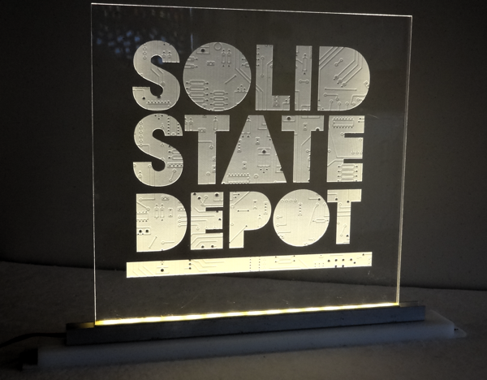

# Automatic Night Lighting Control

The makerPower MPPT Solar Charger "Night Only" mode is designed to enable applications at night as detected by the Solar Panel by controlling the 5V output.

### Night Only Jumper

The charger enters NIGHT state whenever the solar panel voltage is below 3.5 volts. When transitioning from day to night the charger will move from IDLE to NIGHT state five minutes after the voltage is first detected below 3.5 volts. When transitioning from night to day the charger will move from NIGHT to IDLE one minute after the voltage is first detected above 3.5 volts. These timeouts provide a hysteresis function to prevent errant or multiple transitions.

The charger asserts the NIGHT signal during the NIGHT state.

Closing the 5V Power Enable Night Mode jumper J1 with a blob of solder configures the charger to only enable 5V power while the charger is in the NIGHT state. When the charger transitions out of NIGHT state, it will first assert the ALERT signal and then switch off the 5V Buck converter 60 seconds after that. When it transitions into NIGHT state, it will de-assert the ALERT signal and re-enable the 5V power output simultaneously.

The solder jumper can be bridged using a soldering iron to deposit a small blob of solder across the two pads. It can be un-bridged by using solder-wick to remove the solder or dragging a fine tip between the two pads after applying flux to cause the solder to separate into two blobs. Take care to use a fine soldering iron tip and not rip up the jumper pads.  Sparkfun has a [tutorial](https://learn.sparkfun.com/tutorials/how-to-work-with-jumper-pads-and-pcb-traces/all).

## Super Simple USB Spot Light

An inexpensive USB "flashlight" makes a quick & dirty spot light.  Just add jumper J1 and plug the USB light into the charger.

I found the unit shown above on Amazon with bendable extension for just over $7 USD.  Although advertised as a 1.75W device, it draws only 200 mA at 5V (1W) and less than 100 mA from the 12V battery (only about 1.2 Ah per 12 hour night).  With appropriate waterproofing it would make a great path or sign light.

## Sign Lighting using a 12V LED Strip
The Fused 12V battery terminals are available to power higher-voltage loads like commonly available 12V LED strips.  A N-Channel MOSFET transistor can be used as a low-side switch to turn the 12V load on and off as shown in the following diagram.  While either the NIGHT output or +5V output may be used to control the transistor, using the +5V output instead of the NIGHT output allows the charger to prevent the lights from coming on when the battery is fully discharged.

The MOSFET is not super-critical in this application.  It should be able to be fully turned on by the 5V gate voltage, have fairly low on-resistance and be capable of carrying the necessary current.  High power transistors available from [Adafruit](https://www.adafruit.com/product/355) and [Sparkfun](https://www.sparkfun.com/products/10213) will work just fine without any heatsinking.  Take some care as they are ESD sensitive.  

Most 12V LED strips can be cut every 3 LEDs.  Current consumption - and therefore required battery capacity - is computed by the number of 3 LED segments multiplied by the current required by one segment.  Current required by segment depends on the type of LED used in the strip but variers, in my experience, from less than 20 mA for 3528 LEDs to 60 mA for 5050 and 5630 LEDs.  The 5 segment (15 LED) waterproof strip in my photograph requires about 80 mA at 12.5 volts.  It would match well with a 20-25 W Solar Panel and 7 Ah battery.  The system would normally have a very low nightly discharge from the battery resulting in long battery life and the capability of operation for up to a week in low-light conditions (e.g. snow covered solar panels).

They work really well to edge-light etched plexiglass signs.