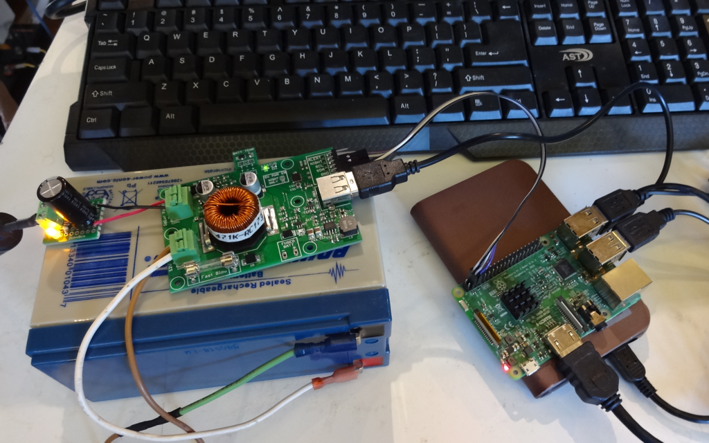
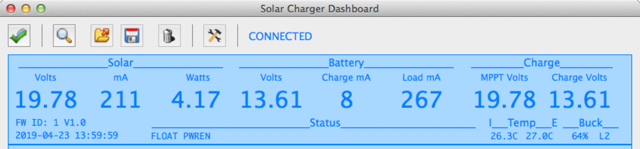
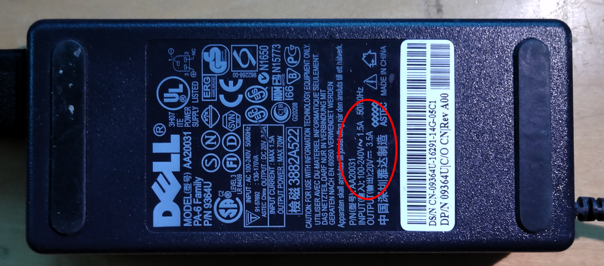
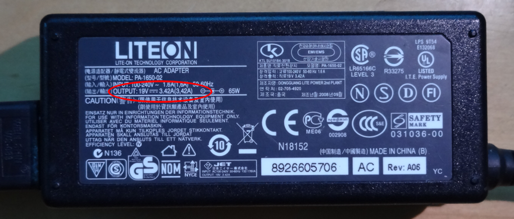
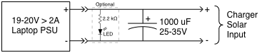
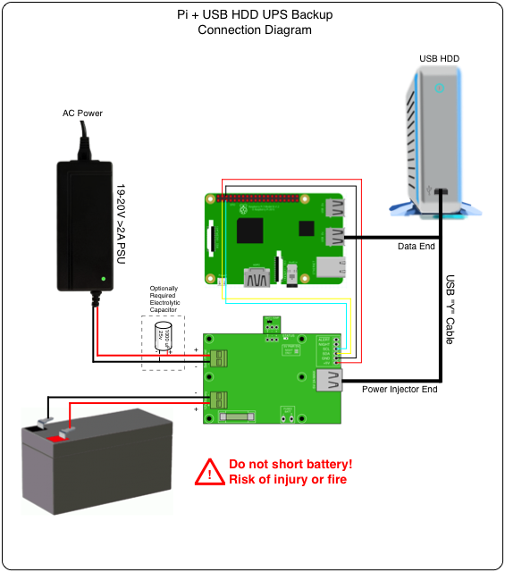

# makerPower™ UPS for Raspberry Pi

The makerPower MPPT Solar Charger can serve as the core of a long-lasting UPS for Raspberry Pi systems when combined with a common laptop power supply.  The ```mpptChgD``` daemon allows the Pi to monitor the UPS as well as shut down in a controlled fashion if the battery becomes exhausted.  While power is applied, the charger both powers the Pi and maintains the battery with a temperature compensated float-charge that lengthens the battery life.



The picture above shows a Raspberry Pi 3 with external hard disk drive running [Nextcloud](https://www.nextcloud.org/) on a [DietPi](https://www.dietpi.com/) distribution.  It can run over 20 hours when power fails using the attached 7 Ah battery.  This system presents a continuous load of about 300 mA at the battery and 200 mA at the 20V AC/DC power supply when the battery is charged.



#### Caveat
The makerPower charger implements a minimum one-hour delay before switching power back on after the battery starts charging from a discharged state.  It does this to prevent an accidental power-on from a bounce in battery voltage that occurs when a load is removed but the battery is still discharged.  This means that there will be at least a one-hour delay in switching power back on after a long power-fail situation has completely drained the battery.  For the vast majority of cases where AC power returns before the battery is discharged this functionality will have no impact.

## Hardware configuration

### Select AC/DC power supply
The system may be powered by an AC/DC power supply with the following requirements.

1. Regulated output of 19-21 VDC.  This voltage is greater than the 18V minimum needed from a solar panel to start charging and available from commonly available external laptop supplies.
2. Capable of supplying greater than 2A.  The charger is capable of sinking up to 2A from the input source.  To prevent the supply from shutting down due to an overcurrent condition it should be capable of supplying greater than 2A.





#### Additional input capacitance

The makerPower charger presents a momentary low-impedance at the beginning of the charge process.  This may trip the over-current detection in some power supplies.  An additional bulk capacitance of about 1000 uF at the input of the charger prevents the supply's protection circuitry from tripping since it will be fully charged by the supply when the charge starts and can supply the necessary initial current.  The value is probably not critical.  I found values between 470 uF - 1000 uF worked fine.  The capacitor should have a 25V or greater rating.  It should be located near the solar input of the charger.




#### USB HDD with Pi
The USB ports on some Raspberry Pi models include circuitry than can current limit.  Powering a USB HDD directly from the Raspberry Pi USB port may not work.  Using a "USB Y Cable" that has a separate USB plug for power allows the HDD to be powered directly by the makerPower charger.



#### Temperature compensation
Make sure the charger Battery Temperature sensor is capable of measuring the approximate battery temperature.  This can be done by mounting the charger with it attached next to the battery or remotely attaching it to the charger and locating it on the battery.

## Software configuration

### Install OS and applications
Configure the Pi with the operating system and applications.  This may be done before the Pi is connected to the makerPower charger or after.  The following instructions support both Raspian and DietPi (as they existed when this was written).

### Configure I2C
Enable the I2C interface if the distribution requires it.

1. Use the ```raspi-config``` program on Raspbian distributions.
2. Use the ```dietpi-config``` program on DietPi distributions.

Edit ```/boot/config.txt``` to configure a 50 kHz I2C clock rate to work around the clock-stretch bug in the Pi hardware.

```
dtparam=i2c_arm_baudrate=50000
```

#### Interesting Note
I forgot to make the baud-rate change on my test system and the I2C communication still seemed to work.  Perhaps they are now including a fix in later kernels.  YMMV.

```Linux raspberrypi 4.14.34-v7+ #1110 SMP Mon Apr 16 15:18:51 BST 2018 armv7l```

### Install and configure mpptChgD
The ```mpptChgD``` daemon and example configuration file can be found in the ```mpptChgD``` directory at the top of this repository.

#### Install the daemon and wiringPi library
1. Copy the ```mpptChgD``` daemon to ```/usr/local/bin``` and give it executable permissions (```sudo chmod 755 mpptChgD```).
2. Either install and build [wiringPi]() or copy the ```wiringPi.so.X.Y``` library to ```/usr/local/lib``` and create a soft link (```sudo ln -s wiringPi.so.X.Y wiringPi.so```).
3. Copy the ```mpptChgDconfig.txt``` file to a known location such as ```/home/pi``` or ```/home/dietpi```.

#### Configure mpptChgDconfig.txt
Edit the ```mpptChgDconfig.txt``` file to enable functionality.

1. Uncomment ```SHUTDOWN=1``` to enable auto-shutdown on a fully discharged battery.  This will allow your Pi to perform a controlled shutdown before power is removed.
2. [Optionally] enable remote access via the network by uncommenting the ```TCP_PORT``` and ```TCP_MAX``` entries.  This may be used by the ```mppt_dashboard``` program or other applications to communicate with the charger.  Note that this may introduce a security hole via the network.
3. [Optionally] enable logging by uncommenting ```LOG_FILE```, ```LOG_DELAY``` and one or more of the ```LOG=XXX``` items.  Note that the LOG_FILE should point to an existing directory such as ```/home/pi``` or ```/home/dietpi```.  This should not normally be necessary.
4. [Optionally] uncomment ```PWRONV=12500``` and set the value to a lower number such as 11750 to reduce the time the power is re-enabled to the Pi after a battery discharge shutdown and AC power is restored to the minimum 1 hour.
5. [Optionally] uncomment ```WATCHDOG=1``` to enable the charger to automatically reboot the Pi if it crashes (or the daemon is killed).

#### Configure the system to start mpptChgD on boot
Edit, as super-user, the ```/etc/rc.local``` file and add the following line to automatically start the daemon on boot.  Be sure the charger is connected before rebooting.

For Raspbian with the configuration file located in ```/home/pi```

```
/usr/local/bin/mpptChgD -d -f /home/pi/mpptChgDconfig.txt &
```

For DietPi with the configurtion file located in ```/home/dietpi```

```
/usr/local/bin/mpptChgD -d -f /home/dietpi/mpptChgDconfig.txt &
```

