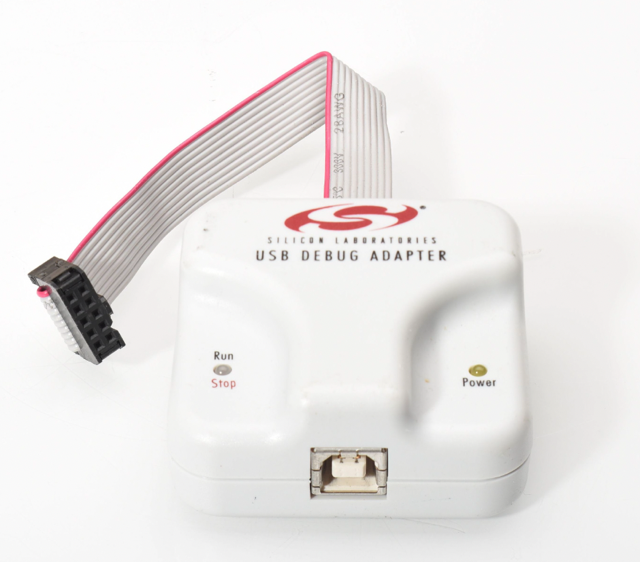
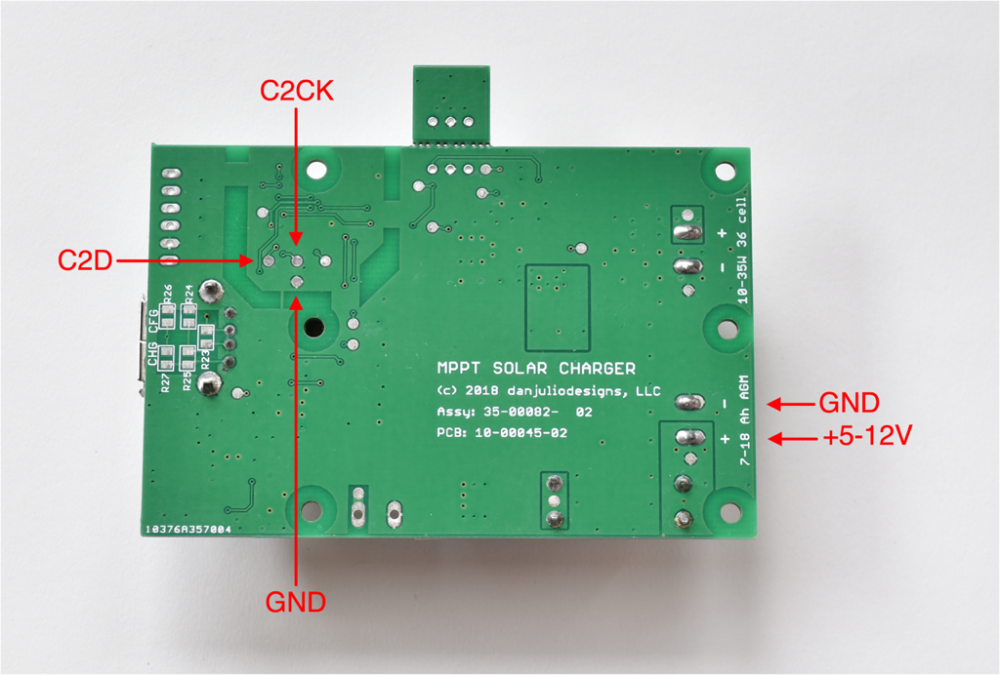
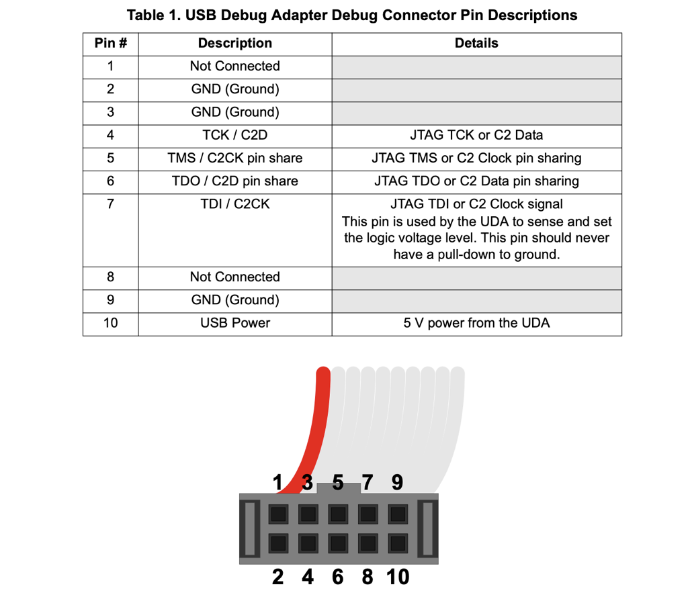
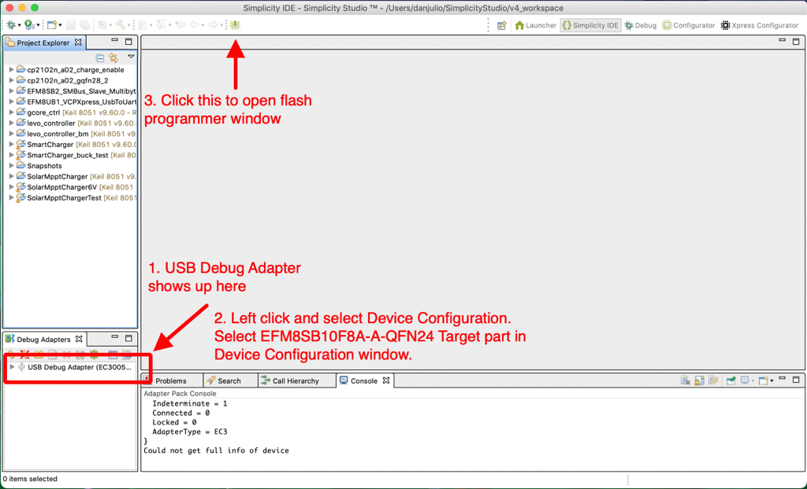
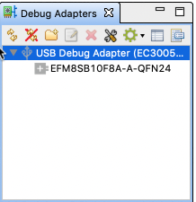
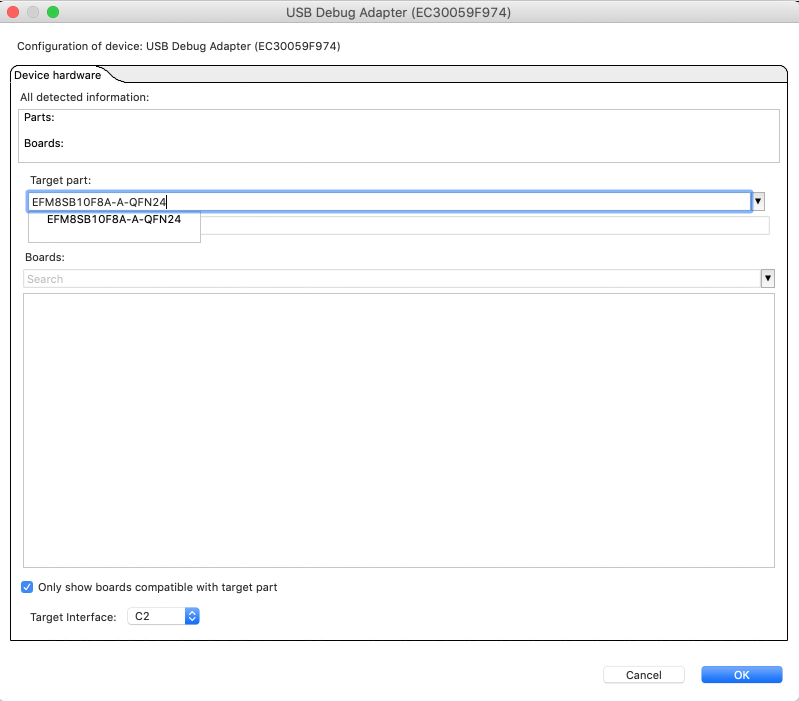
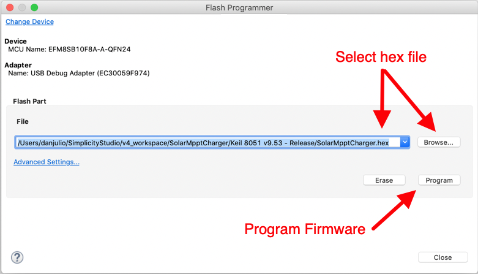

## makerPower™ MPPT Solar Charger firmware

This directory contains the firmware for the Silicon Labs EFM8SB10F8 micro-controller on the 35-00082-02 PCB Assembly.

Code is developed using Simplicity Studio version 4.1.14.

### Updating to FW 2.0 (LiFePO4 support)

You can update the firmware on existing boards if you have some soldering skill and know your way (or aren't afraid to learn your way) around development software.

You will need a [Silicon Labs USB Debug Adapter](https://www.silabs.com/development-tools/mcu/8-bit/8-bit-usb-debug-adapter?tab=overview) and to install [Simplicity Studio](https://www.silabs.com/developers/simplicity-studio).  At the time of this writing Simplicity Studio is at version 5.  I used version 4.1.14 and the pictures below are taken from that version.  I think the ideas should translate to version 5 but you may have to do some reading and searching around.  You may also be able to find the USB Debug Adapter for less money elsewhere.



#### Wiring the USB Debug Adapter to the board
The board is designed to be programmed in a special test fixture with spring-loaded pogo-pins contacting pads on the bottom of the PCB.  You will have to connect two wires between USB Debug Adapter connector and the bottom of the board and another two wires to the battery input on the charger (to power the board).

Use a light touch when soldering wires to the pads, and then removing them after programming.  Use a Q-tip soaked with isopropyl alcohol to clean up any flux after you are done.  The ubiquitous 28 AWG Dupont jumpers with male ends from the Arduino world are good to use.  Chop the ends off of two of them, strip and tin 1/16" (1.5 mm) to solder to the C2D and C2CK pads.  The male ends can go into the USB Debug Adapter header and the Battery terminal block on the charger PCB.



| USB Debug Adapter | MPPT Solar Charger |
| --- | --- |
| 9 - GND | GND / (-) Battery Terminal |
| 10 - USB Power (5V) | (+) Battery Terminal |
| 4 - TCK / C2D  | C2D pad on PCB Bottom |
| 7 - TDI / C2CK | C2CK pad on PCB Bottom |

See the USB Debug Adapter pinout shown below from a picture in its user guide.



#### Configure Simplicity Studio
Plug the USB Debug Adapter into your computer's USB port and start Simplicity Studio.  Simplicity Studio should see the adapter and list it (maybe you'll have to perform additional downloads).



You will need to left-click the USB Debug Adapter name and select Device Configuration to bring up a window that lets you configure it for the micro-controller used by the charger.



Type "EFM8SB10F8A-A-QFN24" into the Target Part Window and then select it from the list that pops up and click OK.  It's possible you'll have to download something into Simplicity Studio before it knows about the EFM8 micros.



#### Program the new firmware

Click the Programmer icon in the Simplicity Studio toolbar (shown above).  This should bring up the Flash Programmer window.  It should show the proper device and programmer but you can Change Device to select the USB Debug Adapter if it doesn't show up right away.



Click Browse and select the ```SolarMpptCharger.hex``` file in the ```SolarMpptCharger/Keil 8051 v9.53 - Release/``` directory. 

Then click Program to load the new firmware into the attached charger.
