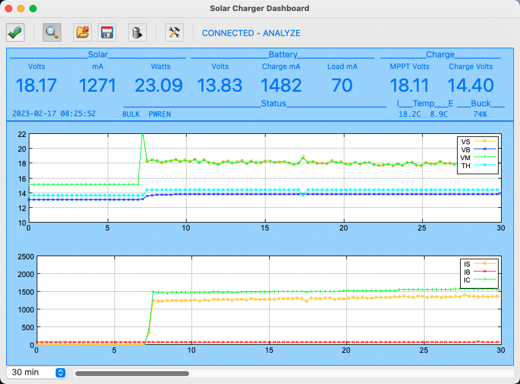

## mppt_dashboard Application



This directory contains the mppt_dashboard xojo project, built binaries for Windows, Linux and Mac OS X, and a user manual.  [Xojo](https://www.xojo.com) is a commercial cross-platform development tool I use for rapid application development.  It requires a license in order to spit out compiled binaries but it has a demo mode that allows you to build and run an application from within the IDE without a license.

### Installing and running pre-built binaries
The ```Builds``` directory contains the pre-compiled binaries for x86-64 Linux, OS X and Windows.  The easiest way to install the application is to copy the architecture-specific sub-directory into the install location.  Running it is slightly platform-specific.

### Linux
The application is compiled for 64-bit systems supporting a graphic user interface such as Mint, Ubuntu or Debian.

You may have to make sure the binary, ```mppt_dashboard```, is executable with the appropriate permissions for the logged in user.

	```chmod 755 mppt_dashboard```

Then the program may be started, either from a command line in a terminal or usually by double-clicking it from a file viewer.

### Mac OS X
The 64-bit application should appear as a proper Macintosh application bundle that can be started by double-clicking the bundle icon.

### Windows
The application is compiled as a 64-bit version.

Use the file viewer to descend into the ```mppt_dashboard``` folder and then double-click the ```mppt_dashboard.exe``` file to start the application.