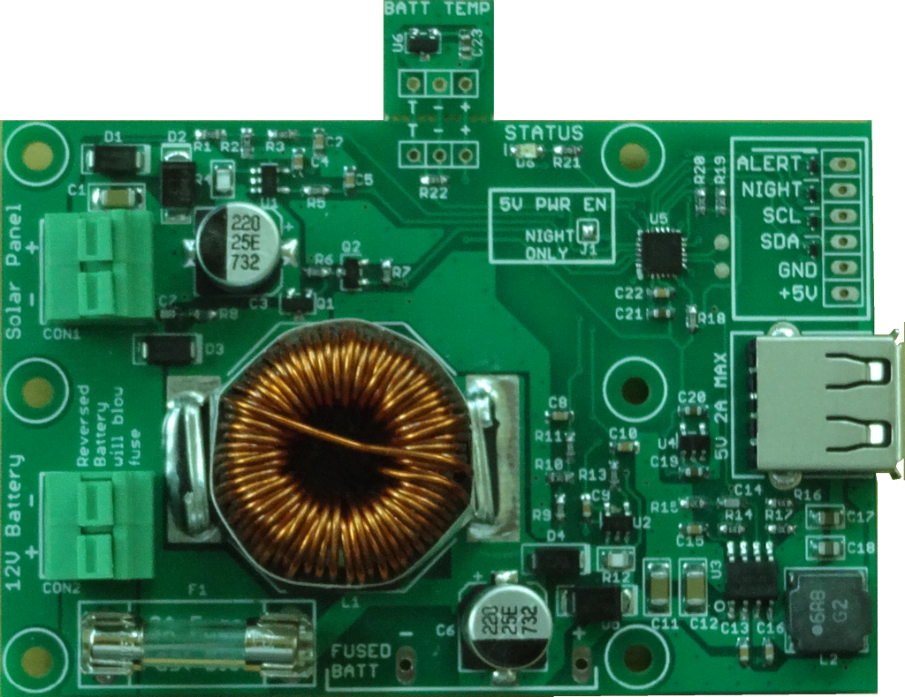

## MPPT Solar Charger

This repository contains documentation and software for the MPPT Solar Charger board.  The MPPT Solar Charger is a combination solar battery charger and 5V power supply for IOT-class devices designed for 24/7 operation off of solar power. It manages charging a 12V AGM lead acid battery from common 36-cell 12V solar panels.  It provides 5V power output at up to 2A for systems that include sensors or communication radios (although designed for average power consumption of 500 mA or less).  Optimal charging is provided through a dynamic perturb-and-observe maximum power-point transfer converter (MPPT) and a 3-stage (BULK, ABSORPTION, FLOAT) charging algorithm.  A removable temperature sensor provides temperature compensation.  Operation is plug&play although additional information and configuration may be obtained through a digital interface.

* Reverse Polarity protected solar panel input with press-to-open terminal block
* Fused battery input with press-to-open terminal block
* Maximum 2A at 5V output on USB Type A power output jack and solder header
* Automatic low-battery disconnect and auto-restart on recharged battery
* Temperature compensation sensor with internal sensor fallback
* Status LED indicating charge and power conditions, fault information
* I2C interface for detailed operation condition readout and configuration parameter access
* Configurable battery charge parameters
* Status signals for Night detection and pre-power-down alert
* Night-only operating mode (switch 5V output on only at night)
* Watchdog functionality to power-cycle connected device if it crashes

### Contents

1. hardware - Board documentation and schematic
2. arduino - Arduino library and examples (can be compiled with wiringPi for Raspberry Pi too)
3. mppt_dashboard - Mac OS, Windows and Linux monitoring application that communicates with the charger via the mpptChgD daemon
4. mpptChgD - Linux Daemon compiled for Raspberry Pi that communicates with the charger via I2C

### Questions?

Contact the designer - dan@danjuliodesigns.com
