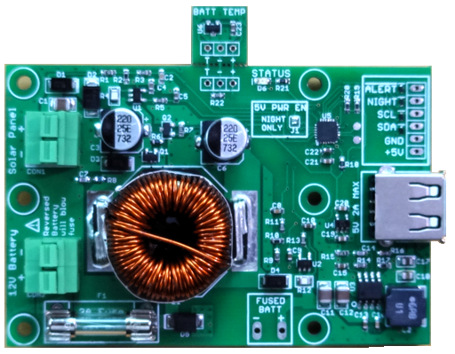

## MPPT Solar Charger

### Contents
This repository contains documentation and software for the MPPT Solar Charger board (design documented at [hackaday.io](https://hackaday.io/project/161351-solar-mppt-charger-for-247-iot-devices)).  

1. hardware - Board documentation, schematic and connection diagrams for different uses
2. arduino - Arduino library and examples (can be compiled with wiringPi for Raspberry Pi too)
3. mppt_dashboard - Mac OS, Windows and Linux monitoring application that communicates with the charger via the mpptChgD daemon
4. mpptChgD - Linux Daemon compiled for Raspberry Pi that communicates with the charger via I2C

The MPPT Solar Charger is a combination solar battery charger and 5V power supply for IOT-class devices designed for 24/7 operation off of solar power. It manages charging a 12V AGM lead acid battery from common 36-cell 12V solar panels.  It provides 5V power output at up to 2A for systems that include sensors or communication radios.  Optimal charging is provided through a dynamic perturb-and-observe maximum power-point transfer converter (MPPT) and a 3-stage (BULK, ABSORPTION, FLOAT) charging algorithm.  A removable temperature sensor provides temperature compensation.  Operation is plug&play although additional information and configuration may be obtained through a digital interface.

* Optimized for commonly available batteries in the 7-18 Ah range and solar panels in the 10-35 Watt range
* Reverse Polarity protected solar panel input with press-to-open terminal block
* Fused battery input with press-to-open terminal block
* Maximum 2A at 5V output on USB Type A power output jack and solder header
* Automatic low-battery disconnect and auto-restart on recharged battery
* Temperature compensation sensor with internal sensor fallback
* Status LED indicating charge and power conditions, fault information
* I2C interface for detailed operation condition readout and configuration parameter access
* Configurable battery charge parameters
* Status signals for Night detection and pre-power-down alert
* Night-only operating mode (switch 5V output on only at night)
* Watchdog functionality to power-cycle connected device if it crashes

### Applications
* Remote control and sense applications
* Solar powered web or timelapse camera
* Night-time “critter cam"
* Solar powered LED night lighting controller

#### Bonus Application
The charger works well as a 12- and/or 5-V UPS when combined with a laptop power supply.  The laptop supply should be able to supply at least 3.5A at between 18.5 - 21V output (for example a Dell supply at 20V/3.5A) - a high enough voltage to initiate charging.  The charger will both charge the battery and supply the load current to the user's device and the battery will supply power if AC power fails.

### Compatible Solar Panels and Batteries
The MPPT Solar Charger is designed to use standard 25- or 35-Watt 12V solar panels with AGM type 7-Ah to 18-Ah 12V lead acid batteries. It has a maximum charge capacity of about 35-38 watts. A detailed sizing method is described in the user manual but it is possible to use smaller or larger panels and batteries depending on the application.

Typically a 25-Watt panel is paired with a 7-Ah battery for small systems (Arduino-type up to Raspberry Pi Zero type). A 35-Watt panel is paired with 9-Ah to 18-Ah batteries for larger systems. Larger batteries provide longer run-time during poor (lower light) charging conditions. A larger panel can provide more charge current during poor charging conditions.

Solar panels should be a 36-cell type with a typical maximum power-point of around 18V and maximum open-circuit voltage of 23V. Available panels and batteries I have tested with are shown below.

* [25 Watt Panel](https://www.amazon.com/gp/product/B014UND3LA)
* [35 Watt Panel](https://www.amazon.com/gp/product/B01G1II6LY)
* [9 Ah Battery](https://www.amazon.com/Power-Sonic-PS-1290-Rechargeable-Battery-Terminals/dp/B002L6R130)
* [18 Ah Battery](https://www.amazon.com/ExpertPower-EXP12180-Rechargeable-Battery-Bolts/dp/B00A82A3RK)

### Enclosures

I have used the [Carlon E989N](https://www.homedepot.com/p/Carlon-8-in-x-4-in-PVC-Junction-Box-E989N-CAR/100404099) enclosure found at a Home Depot home improvement store to hold the battery, charger and single-board computer.  It is a good size providing room for a 7- or 9-Ah battery as well as room for heat dissipation from both the charger and computer.  Note that the charger can dissipate upwards of 5W when running at full capacity.

Other possible enclosures include the following.  I haven't yet tested them but are available through normal distribution channels like Mouser.

* Hammond Manufacturing [RP1465/RP1465C](https://www.hammfg.com/electronics/small-case/plastic/rp)
* Bud Industries [PIP-11774/PIP-11774-C](https://www.budind.com/view/NEMA+Boxes/NEMA+4X+-+PIP)

### Questions?

Contact the designer - dan@danjuliodesigns.com
